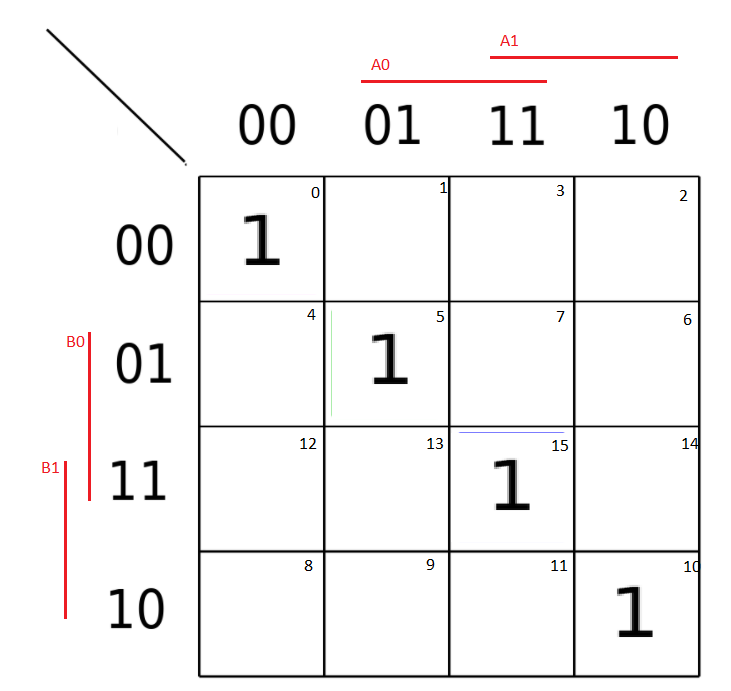
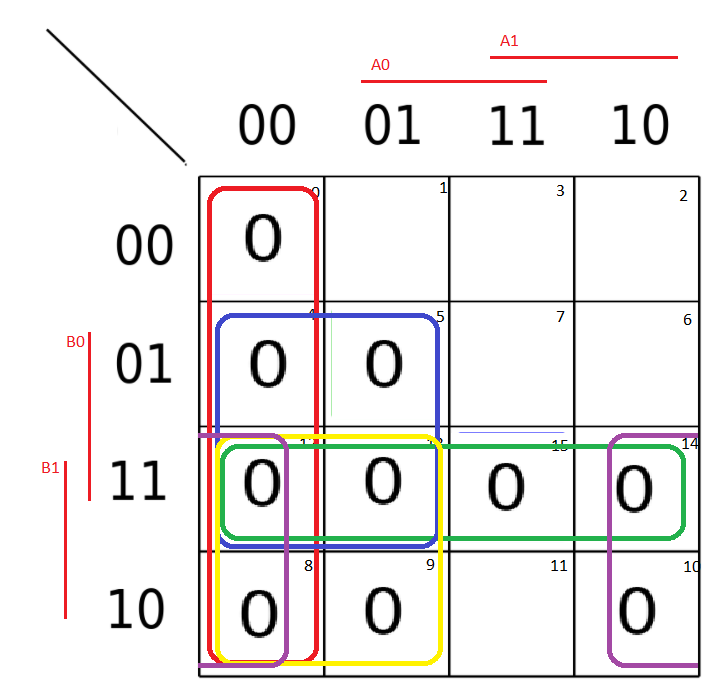
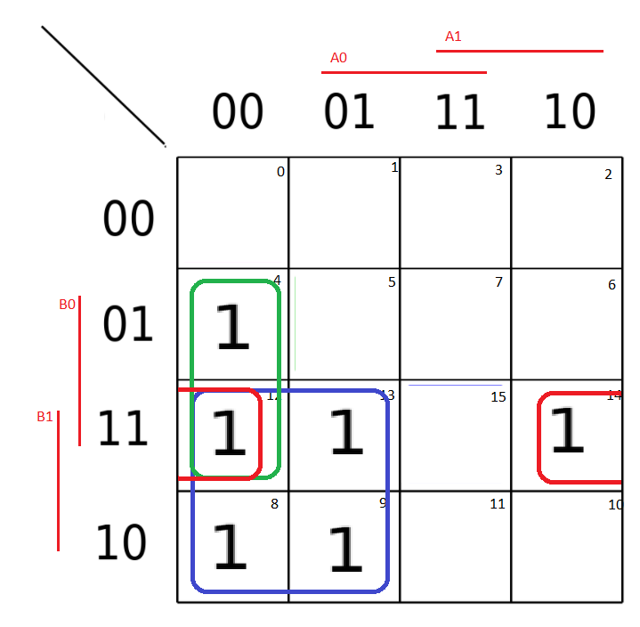

# CV-02-Logic
[Repository](https://github.com/Vitekmasa)

## Task 1 (Preparation task)

### 2-bit comparator truth table

| **Dec. equivalent** | **B[1:0]** | **A[1:0]** | **B is greater than A** | **B equals A** | **B is less than A** |
| :-: | :-: | :-: | :-: | :-: | :-: |
| 0 | 0 0 | 0 0 | 0 | 1 | 0 |
| 1 | 0 0 | 0 1 | 0 | 0 | 1 |
| 2 | 0 0 | 1 0 | 0 | 0 | 1 |
| 3 | 0 0 | 1 1 | 0 | 0 | 1 |
| 4 | 0 1 | 0 0 | 1 | 0 | 0 |
| 5 | 0 1 | 0 1 | 0 | 1 | 0 |
| 6 | 0 1 | 1 0 | 0 | 0 | 1 |
| 7 | 0 1 | 1 1 | 0 | 0 | 1 |
| 8 | 1 0 | 0 0 | 1 | 0 | 0 |
| 9 | 1 0 | 0 1 | 1 | 0 | 0 |
| 10 | 1 0 | 1 0 | 0 | 1 | 0 |
| 11 | 1 0 | 1 1 | 0 | 0 | 1 |
| 12 | 1 1 | 0 0 | 1 | 0 | 0 |
| 13 | 1 1 | 0 1 | 1 | 0 | 0 |
| 14 | 1 1 | 1 0 | 1 | 0 | 0 |
| 15 | 1 1 | 1 1 | 0 | 1 | 0 |

## Task 2

### K-map B equals A


### K-map B greater A

#### Product of Sums


### K-map B less A

#### Sum of Products


### 2-bit graphic output

[2-bit binary comparator (Code)](https://www.edaplayground.com/x/VRQh)

## Task 3
[4-bit binary comparator (Code)](https://www.edaplayground.com/x/iRss)
### Architecture from design file
```VHDL
entity comparator_4bit is
    port(
    	a_i           : in  std_logic_vector(4 - 1 downto 0);
	b_i           : in  std_logic_vector(4 - 1 downto 0);

        -- COMPLETE ENTITY DECLARATION

	B_greater_A_o    : out std_logic;
	B_equals_A_o    : out std_logic;
    	B_less_A_o    : out std_logic       -- B is less than A
    );
end entity comparator_4bit;

------------------------------------------------------------------------
-- Architecture body for 4-bit binary comparator
------------------------------------------------------------------------
architecture Behavioral of comparator_4bit is
begin
    
    	B_less_A_o    <= '1' when (b_i < a_i) else '0';
    	B_greater_A_o <= '1' when (b_i > a_i) else '0';
    	B_equals_A_o  <= '1' when (b_i = a_i) else '0';
    -- WRITE "GREATER" AND "EQUALS" ASSIGNMENTS HERE


end architecture Behavioral;

```
### Stimulus process from testbench file
```VHDL
    begin
        -- Report a note at the begining of stimulus process
        report "Stimulus process started" severity note;


        -- First test values
        s_b <= "0000"; s_a <= "0000"; wait for 100 ns;
        -- Expected output
        assert ((s_B_greater_A = '0') and (s_B_equals_A = '1') and (s_B_less_A = '0'))
        -- If false, then report an error
        report "Test failed " severity error;
        -- second test values
        s_b <= "0000"; s_a <= "0001"; wait for 100 ns;
        -- Expected output
        assert ((s_B_greater_A = '0') and (s_B_equals_A = '0') and (s_B_less_A = '1'))
        -- If false, then report an error
        report "Test failed" severity error;
        -- third test values
        s_b <= "0001"; s_a <= "0000"; wait for 100 ns;
        -- Expected output
        assert ((s_B_greater_A = '1') and (s_B_equals_A = '0') and (s_B_less_A = '0'))
        -- If false, then report an error
        report "Test failed" severity error;
        -- 4th test values
        s_b <= "0001"; s_a <= "0001"; wait for 100 ns;
        -- Expected output
        assert ((s_B_greater_A = '0') and (s_B_equals_A = '1') and (s_B_less_A = '0'))
        -- If false, then report an error
        report "Test failed " severity error;
        -- 5th test values
        s_b <= "0000"; s_a <= "1000"; wait for 100 ns;
        -- Expected output
        assert ((s_B_greater_A = '0') and (s_B_equals_A = '0') and (s_B_less_A = '1'))
        -- If false, then report an error
        report "Test failed " severity error;
        -- 6th test values
        s_b <= "1000"; s_a <= "0000"; wait for 100 ns;
        -- Expected output
        assert ((s_B_greater_A = '1') and (s_B_equals_A = '0') and (s_B_less_A = '0'))
        -- If false, then report an error
        report "Test failed " severity error;
        -- 7th test values
        s_b <= "1000"; s_a <= "1000"; wait for 100 ns;
        -- Expected output
        assert ((s_B_greater_A = '0') and (s_B_equals_A = '1') and (s_B_less_A = '0'))
        -- If false, then report an error
        report "Test failed " severity error;
        -- 8th test values
        s_b <= "0110"; s_a <= "1110"; wait for 100 ns;
        -- Expected output
        assert ((s_B_greater_A = '0') and (s_B_equals_A = '0') and (s_B_less_A = '1'))
        -- If false, then report an error
        report "Test failed " severity error;
        -- 9th test values
        s_b <= "1110"; s_a <= "0110"; wait for 100 ns;
        -- Expected output
        assert ((s_B_greater_A = '1') and (s_B_equals_A = '0') and (s_B_less_A = '0'))
        -- If false, then report an error
        report "Test failed " severity error;
        -- 10th test values
        s_b <= "1011"; s_a <= "1101"; wait for 100 ns;
        -- Expected output
        assert ((s_B_greater_A = '0') and (s_B_equals_A = '1') and (s_B_less_A = '0'))
        -- If false, then report an error
        report "Test failed for input combination: 1011, 1011" severity error;
           
      
        
      -- WRITE OTHER TESTS HERE


        -- Report a note at the end of stimulus process
        report "Stimulus process finished" severity note;
        wait;
    end process p_stimulus;

end architecture testbench;
```
### Simulator console output with one reported error
```VHDL
[2021-02-18 21:57:33 EST] ghdl -i design.vhd testbench.vhd  && ghdl -m  tb_comparator_4bit && ghdl -r  tb_comparator_4bit   
analyze design.vhd
analyze testbench.vhd
elaborate tb_comparator_4bit
testbench.vhd:51:9:@0ms:(report note): Stimulus process started
testbench.vhd:111:9:@1us:(assertion error): Test failed for input combination: 1011, 1011
testbench.vhd:121:9:@1us:(report note): Stimulus process finished
Done
```
